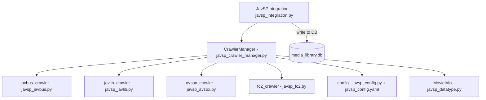

# JavSP 多源爬虫框架

一个三级回退爬虫系统，在统一的 `CrawlerManager` 接口背后聚合了多个数据源（JavBus、JavLibrary、AvSox、FC2）。当 JavDB 和 JavBus 主爬虫无法返回完整的元数据时激活。

## 架构

*CrawlerManager 协调 4 个数据源爬虫，支持可配置的优先级和并行搜索。JavSPIntegration 将结果桥接到媒体库数据库中。*

## 核心组件

### `javsp_crawler_manager.py`
- `CrawlerManager` 类：通过基于优先级的选择来协调所有爬虫
- `search_movie_info(code)`：跨所有已启用的爬虫进行搜索的顶层函数
- `get_crawler_status()`：报告哪些爬虫可用
- 使用 `ThreadPoolExecutor` 进行并行搜索（最多使用配置中的 `max_workers`）
- 导入操作被包裹在 `try/except` 中，因此缺失的数据源模块不会破坏框架

### `javsp_integration.py`
- `JavSPIntegration` 类：JavSP 与媒体库之间的桥接
- 初始化 `CrawlerManager` 并提供高级方法
- 使用 `utils/db.py`（`upsert_jav_info`、`upsert_actors`、`upsert_tags`）将结果写入 `media_library.db`
- 由 `javdb_information_updater.py` 作为第三级回退调用

### `javsp_datatype.py`
- `MovieInfo` 数据类：统一的电影信息结构
- 将来自不同数据源的字段规范化为通用模式（标题、演员、标签、封面等）

### `javsp_base.py`
- 基类和异常：`CrawlerError`、`MovieNotFoundError`、`NetworkError`
- 带有重试和代理处理的通用 HTTP 请求逻辑

### 独立数据源模块

| 文件 | 数据源 | 优先级 |
|------|--------|----------|
| `javsp_javbus.py` | JavBus | 1（最高） |
| `javsp_javlib.py` | JavLibrary | 2 |
| `javsp_avsox.py` | AvSox | 3 |
| `javsp_fc2.py` | FC2 | 4 |

每个模块导出一个符合 `CrawlerManager` 接口的单一爬虫函数。

### `utils/javsp_copy.py`（约 330 行）
独立的 JavSP 复制工具。提供基于文件复制的媒体管理，并集成 JavSP 元数据。

### `utils/javsp_migration.py`（约 190 行）
用于将 JavSP 风格数据导入媒体库数据库架构的迁移辅助工具。

### `utils/javsp_integration.py`（薄包装）
从根目录的 `javsp_integration.py` 重新导出，以便在 `utils/` 包内使用。

## 配置

有关 `javsp_config.py` 和 `javsp_config.yaml` 的完整详细信息，请参阅 [JavSP 配置](../configuration/JavSP_configs.md)。关键设置：
- 已启用的爬虫列表及优先级顺序
- 并行搜索设置（`max_workers`、`timeout`）
- 网络代理配置（SOCKS5）
- 标题清理规则

## 另请参阅

- [爬虫系统概述](overview.md) —— 三级回退架构
- [视频爬虫](video_crawlers.md) —— JavDB 主爬虫（前两级）
- [JavSP 配置](../configuration/JavSP_configs.md) —— 配置文件
- [数据库概述](../database/overview.md) —— 目标架构