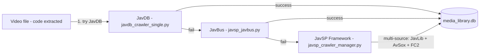

# 爬虫系统概述

本系统通过三层回退策略从多个来源获取视频元数据（标题、演员、标签、封面、评分、发行日期、磁力链接）。

*三层回退：JavDB -> JavBus -> JavSP 多源框架。*

## 爬虫分类

### 主要：JavDB 爬虫
- **[javdb_login_helper.py](actor_crawlers.md)** — 通过专用的浏览器用户数据目录保持持久登录状态
- **[javdb_crawler.py](video_crawlers.md)** — 批量逐页抓取
- **[javdb_crawler_single.py](video_crawlers.md)** — 单个视频元数据提取
- **[javdb_information_updater.py](video_crawlers.md)** — 支持文件夹选择的批量更新器
- **[nas_javdb_updater.py](video_crawlers.md)** — 使用 Playwright 持久化机制的 NAS 专用更新器

### 备用：JavSP 多源框架
- **[javsp_crawler_manager.py](JavSP_crawlers.md)** — 编排 4 个以上的源爬虫，支持优先级和并行搜索
- **[javsp_javbus.py](JavSP_crawlers.md)**、**[javsp_javlib.py](JavSP_crawlers.md)**、**[javsp_avsox.py](JavSP_crawlers.md)**、**[javsp_fc2.py](JavSP_crawlers.md)** — 独立源模块
- **[javsp_integration.py](JavSP_crawlers.md)** — JavSP 与媒体库之间的桥梁

### 演员专属爬虫
- **[actor_crawler_with_db.py](actor_crawlers.md)** — 演员资料抓取（头像、简介）
- **[actor_crawler_headless_db.py](actor_crawlers.md)** — 无头浏览器变体
- **[actor_detail_crawler.py](actor_crawlers.md)** — 详细演员信息
- **[javdb_actor_all.py](actor_crawlers.md)** — 演员的所有作品及磁力链接
- **[favorite_actor_works_crawler.py](actor_crawlers.md)** — 收藏演员的完整作品

## 通用基础设施

- **代理支持**：通过 `config.py` 设置 SOCKS5 代理（`SOCKS5_PROXY_HOST`、`SOCKS5_PROXY_PORT`）
- **域名轮换**：`config.py` 维护 JavDB 镜像域名列表（`JAVDB_ALTERNATE_DIRECT_DOMAINS`）以用于直接访问回退
- **URL 规范化**：`config.normalize_javdb_url()` 将 URL 重写为当前活动域名
- **登录持久化**：共享浏览器用户数据目录（`~/.javdb_scraper/user_data`），只需执行一次登录
- **随机延迟**：`config.py` 中的 `MIN_DELAY` / `MAX_DELAY` 用于模拟人类浏览模式
- **数据库写入**：所有爬虫通过 `utils/db.py` 辅助函数（`upsert_jav_info`、`upsert_actors`、`upsert_tags`）将元数据写入 `media_library.db`

## 另请参阅

- [视频爬虫](video_crawlers.md) — JavDB 主要爬虫
- [演员爬虫](actor_crawlers.md) — 演员专属爬虫
- [JavSP 系统](JavSP_crawlers.md) — 多源回退框架
- [数据库概述](../database/overview.md) — 抓取数据的存储位置