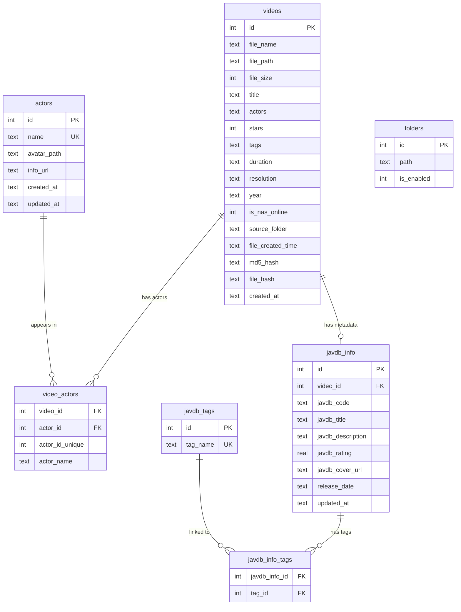

# 数据库概述

整个媒体库由单个 SQLite 数据库提供支持：项目根目录下的 `media_library.db`。所有 GUI 版本、爬虫、导入器和分析工具均从该数据库读取和写入数据。

## 实体关系图

*核心实体关系。`videos` 表是中心枢纽；元数据、演员和标签通过关联表进行链接。*

## 关键表

| 表名 | 用途 | 写入方 |
|-------|---------|-----------|
| `videos` | 核心视频记录（文件路径、MD5、标题、评分等） | 导入器、扫描器、GUI |
| `actors` | 演员档案（姓名、头像、资料链接） | 演员爬虫 |
| `video_actors` | 视频与演员的多对多关联 | 演员爬虫、`utils/db.py` |
| `javdb_info` | JavDB 元数据（番号、标题、评分、封面、发行日期） | JavDB 爬虫 |
| `javdb_tags` | 标签词表（唯一标签名称） | `utils/db.py` `upsert_tags()` |
| `javdb_info_tags` | javdb_info 与标签的多对多关联 | `utils/db.py` `upsert_jav_info()` |
| `folders` | 已知扫描文件夹及启用/禁用标志 | GUI 文件夹管理器 |

## 数据库管理器类

### `utils/database.py` — `DatabaseManager`
GUI 应用程序使用的主要数据库访问层：
- 使用 `check_same_thread=False` 管理 SQLite 连接（支持来自 Qt 工作线程的多线程访问）
- `init_database()`：如果缺失则创建 `actors` 和 `video_actors` 表，并创建索引
- `get_videos()`：带有动态列检测的分页查询（使用 `PRAGMA table_info` 处理架构演进）
- `execute_query()` / `execute_update()` / `execute_many()`：通用查询辅助函数
- 启用外键（`PRAGMA foreign_keys = ON`）

### `utils/db.py` — 底层辅助函数
主要由爬虫脚本使用：
- `get_connection(base_dir)`：使用 `row_factory = sqlite3.Row` 打开连接
- `upsert_actors(conn, actors)`：按名称插入或查找现有演员
- `link_video_actor(conn, video_id, actor_id, actor_name)`：创建视频-演员关联
- `upsert_tags(conn, tags)`：按名称插入或查找现有标签
- `upsert_jav_info(conn, video_id, info)`：插入或更新 JavDB 元数据，处理标签和演员关联

### `pyside_v2/core/bridge.py` — `MediaLibraryCore`
v2 GUI 的数据访问外观类。封装了 `DatabaseManager` 并暴露 v2 组件调用的方法。组件中不包含原始 SQL。

## 索引策略

索引由 `DatabaseManager.init_database()` 创建：

| 索引 | 列 | 用途 |
|-------|-----------|---------|
| `idx_videos_file_path` | `videos.file_path` | 按文件路径快速查找 |
| `idx_videos_md5_hash` | `videos.md5_hash` | 按 MD5 去重 |
| `idx_videos_file_hash` | `videos.file_hash` | 备用哈希查找 |
| `idx_videos_title` | `videos.title` | 标题搜索 |
| `idx_videos_tags` | `videos.tags` | 标签搜索 |
| `idx_videos_year` | `videos.year` | 年份过滤 |

v2 性能优化在 `(is_nas_online, file_created_time)` 上添加了复合索引，用于分页加载。

## 数据库文件位置

数据库文件始终位于项目根目录，通过 `utils/runtime.runtime_path('media_library.db')` 解析。运行时解析器使用 `sys.argv[0]` 作为基准路径，两个启动器（`media_library_v2.py`、`pyside_v2/app.py`）均将其显式设置为项目根目录。

## 另请参阅

- [迁移脚本](migration_scripts.md) — 架构演进与数据迁移
- [同步脚本](synchronization_scripts.md) — 文件名同步与 NAS 更新
- [Utils 模块](../other_directories/utils.md) — `DatabaseManager` 和 `db.py` 详细信息
- [配置](../configuration/overview.md) — 数据库路径配置