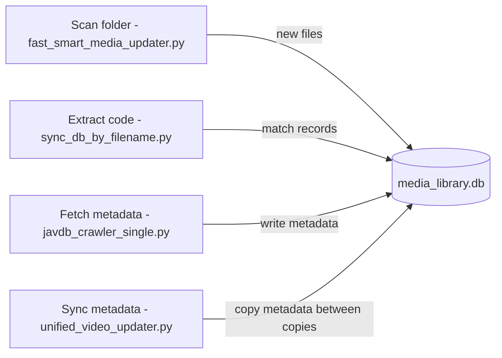

# 同步脚本

使数据库与磁盘上的实际文件保持一致，并在线上与线下副本之间同步元数据的脚本。

## 基于文件名的同步

### `sync_db_by_filename.py`
双向匹配与元数据同步：
1. **文件名/番号提取**：剥离分辨率标签、画质标识和括号注释，以提取标准的视频番号（例如：`ABC-123`、`FC2-1234567`、`heydouga-XXXX-YYY`）
2. **线上文件 <-> 数据库记录匹配**：通过文件名或提取的番号将磁盘上的文件与数据库记录进行匹配
3. **元数据补充**：当线上记录缺少元数据时，从具有相同番号的线下记录中复制
4. **清理**：报告没有数据库记录的文件和没有对应文件的数据库记录

核心函数：`extract_code(filename)` —— 使用正则表达式处理标准番号、FC2 番号和 HeyDouga 番号。

## 智能媒体更新器

### `fast_smart_media_updater.py`
针对文件夹的增量扫描器：
- 仅处理用户选择的线上文件夹
- 检测：新文件（插入）、未更改文件（跳过）、已移动文件（更新路径）、已删除文件（移除记录）
- 使用 `source_folder` 作为查询范围以减少内存占用
- 支持基于 MD5 的移动检测

### `unified_video_updater.py`
元数据同步工具：
- 通过 MD5 或文件名匹配视频
- 批量更新匹配记录的标签、描述和其他元数据
- 在某个副本中抓取或更正元数据后使用

### `nas_javdb_updater.py`
NAS 专用的 JavDB 更新器——详情请参阅[视频爬虫](../crawlers/video_crawlers.md)。在 NAS 环境中使用 Playwright 并进行持久化登录。

## 同步如何融入工作流

## 另请参阅

- [数据库概述](overview.md) —— 模式参考
- [视频爬虫](../crawlers/video_crawlers.md) —— JavDB 元数据抓取器
- [智能更新工具](../utilities/smart_updating_tools.md) —— 可恢复导入器和智能更新器详情