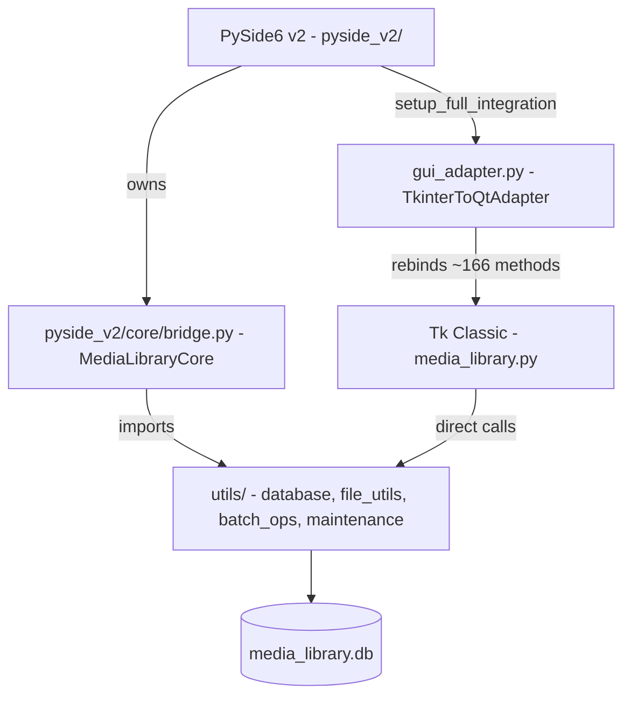

# 主应用程序概述

智能媒体库提供两个 GUI 入口点，它们共享单一的后端工具层和一个 SQLite 数据库。

*两个 GUI 共享 `utils/` 和 `media_library.db`。v2 使用 `gui_adapter` 来重用 Tk 的后端方法而无需进行任何修改。*

## 入口点

| 文件 | GUI 工具包 | 行数 | 状态 |
|------|------------|-------|--------|
| `media_library.py` | Tkinter | ~12,600 | 活跃，同时也作为 v2 的逻辑库 |
| `media_library_v2.py` | PySide6（通过 `pyside_v2/`） | ~48（启动器） | 推荐 |
| `media_library_pyside.py` | PySide6 v1（单文件） | ~6,750 | **已弃用** — 已被 v2 取代 |

## 桥接架构

桥接模式是核心的架构决策。它允许 PySide6 v2 前端重用 `media_library.py` 的所有后端方法（文件扫描、MD5、导入、去重、JAVDB 抓取、标签管理、演员详情等），而无需修改任何一行后端代码。

1. **`gui_adapter.py`** — 定义 `TkinterToQtAdapter`，将 Tkinter 对话框（`askdirectory`、`showinfo`、`showerror` 等）映射到 Qt 等效组件（`QFileDialog`、`QMessageBox`）。`setup_full_integration(qt_window)` 注入共享的 SQLite `conn`/`cursor`，并将 `MediaLibrary` 中约 166 个方法动态重新绑定到 Qt 窗口上。

2. **`pyside_v2/core/bridge.py`** — `MediaLibraryCore` 是一个纯后端门面，拥有共享的 SQLite 连接（`check_same_thread=False`）、`DatabaseManager`、`BatchOperationManager`、`MaintenanceManager`、列配置以及所有非 GUI 逻辑（ffmpeg、GPU、MD5、扫描、导入、缩略图、标签、演员、去重）。它是 v2 组件与后端之间的唯一联系点。

3. **`pyside_v2/core/logging.py`** — 对后端的 `_output_log` 进行猴子补丁（Monkey-patch），将日志消息通过 Qt 信号进行路由，从而使 Tk 的日志系统能够为 v2 的日志面板提供数据。

## 关键设计不变式

- Tk `MediaLibrary` 类既是一个独立的应用程序，也是 v2 的逻辑库。
- v2 组件从不执行原始 SQL（`cursor.execute`）。所有数据访问都通过 `MediaLibraryCore` 方法进行。
- 运行时目录解析（`utils/runtime.py`）使用 `sys.argv[0]` — 两个启动器都将其显式锚定到项目根目录。
- 共享的 SQLite 连接使用 `check_same_thread=False`，以支持来自 Qt 工作线程的多线程访问。

## 另请参阅

- [v1 (Tk Classic)](v1.md) — 完整的 `media_library.py` 文档
- [v2 (PySide6)](v2.md) — 完整的 `pyside_v2/` 包文档
- [数据库概述](../database/overview.md) — 架构和 `DatabaseManager`
- [Utils 模块](../other_directories/utils.md) — 共享工具库