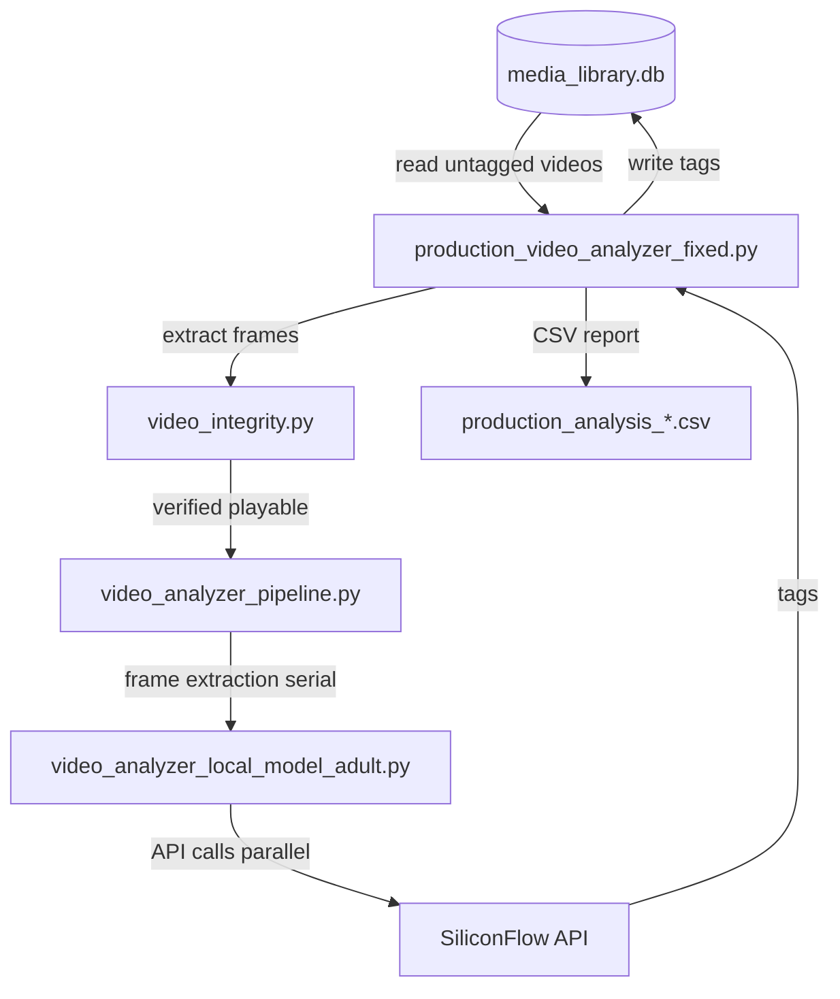

# 视频分析器模块（`video_analyzer/`）

`video_analyzer/` 目录包含一个由 AI 驱动的视频内容分析系统，该系统使用 SiliconFlow API 为视频生成描述性标签。

## 架构


视频分析器数据流：数据库 → 完整性检查 → 流水线 → AI 分析 → 数据库 + CSV。

## 核心组件

### `production_video_analyzer_fixed.py` — 生产环境主脚本
- 从数据库读取未标记的视频
- 协调帧提取和 API 调用
- 将结果写入数据库并生成 CSV 报告
- 支持 `--pipeline` 模式（串行提取 + 并行 API）
- 支持 `--workers N` 设置并发 API 线程数（推荐：10）
- 支持 `--limit N` 进行测试运行

### `video_analyzer_pipeline.py` — 流水线分析器
- 最大化资源利用率：帧提取单线程运行（CPU 密集型），API 调用多线程并行运行（IO 密集型）
- 可恢复：已完成的标签增量写入
- 自动过滤离线文件夹和缺失的文件

### `video_analyzer_local_model_adult.py` — 帧分析器
- 集成 SiliconFlow API 的核心分析逻辑
- 动态帧数：>10 分钟 → 1 帧/分钟（最多 30 帧）；≤10 分钟 → 固定 8 帧
- 图像压缩：宽度 640px，每帧最大 0.4MB
- 标签优先级系统：特色 > 衣着 > 剧情 > 人物 > 动作
- **NAS 感知完整性检查**：`extract_frames()` 和 `extract_frames_random()` 在调用 `check_video_integrity()` 前，会检测视频路径是否以 `/Volumes/`、`//` 或 `smb://` 开头。若是，则自动将 `seek_test` 设为 `False`，跳过 OpenCV 寻道测试。原因是 SMB 网络卷上 OpenCV 的 seek 操作不可靠，会导致完整性检查误判失败。

### `adapter.py` — GUI 桥接
- 提供 `VideoAnalyzer` 类用于集成 `media_library.py`
- 封装分析流水线以供 GUI 调用

### `video_integrity.py` — 完整性检查
- 基本可播放性验证（文件能否打开？）
- 寻道测试：验证随机访问不会挂起（防止在损坏文件上导致流水线停滞）
- 调用方（如 `video_analyzer_local_model_adult.py`）可通过 `seek_test=False` 参数禁用寻道测试，用于 NAS/网络卷路径

### `config.py` — 配置
- `SILICONFLOW_BASE_URL`: `https://api.siliconflow.cn/v1`
- 模型：`THUDM/GLM-4.1V-9B-Thinking`（可配置）
- `MAX_RETRIES`: 3, `API_TIMEOUT`: 180s
- `DEFAULT_MAX_FRAMES`: 30, `TARGET_WIDTH`: 1024

### `vocabulary_tags.txt`
分析器可分配的 122 个预定义标签。按优先级排列。

## 模型对比

| 方面 | Qwen3-VL-8B | Qwen3-VL-30B-A3B |
|--------|-------------|-------------------|
| 架构 | 稠密 | MoE（激活 3B） |
| 速度 | 慢 | 快 2-3 倍 |
| 识别率 | 低（部分全为 "none"） | 100% |
| 细节丰富度 | 一般 | 丰富且具体 |
| 成本 | 相似 | 相似 |

## 使用方法

```bash
# Full tag fill (pipeline mode)
cd video_analyzer && python3 production_video_analyzer_fixed.py --pipeline --workers 10 --verbose

# Test mode (10 videos)
cd video_analyzer && python3 production_video_analyzer_fixed.py --pipeline --workers 10 --limit 10 --verbose
```

## API 密钥

从环境变量 `SILICONFLOW_API_KEY`（在 `.env` 中设置）读取。

## 另请参阅

- [其他目录概览](overview.md) — 所有辅助目录
- [视频标签](../utilities/retagging_tools.md) — 基于规则的标签系统（互补）