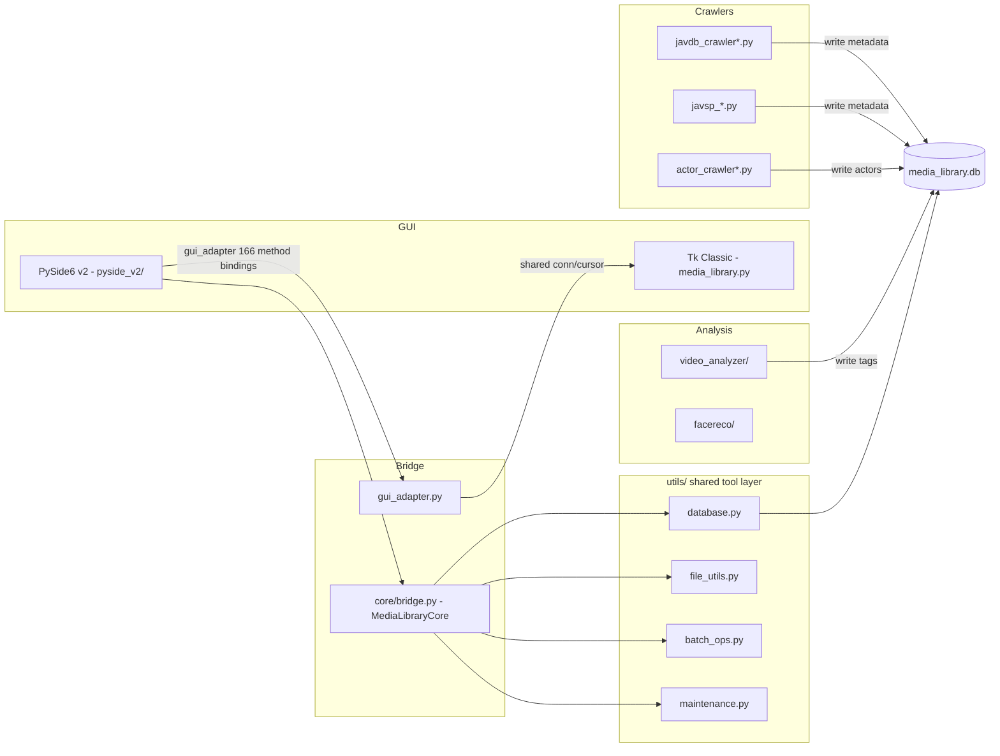

# 智能媒体库 — 快速入门

一个跨平台视频媒体管理系统，具备 MD5 去重、智能元数据爬取（JavDB / JavBus / JavSP 多源回退）、AI 视频打标签（SiliconFlow Qwen3-VL）以及 NAS 感知的文件同步功能。底层由单一 SQLite 数据库（`media_library.db`）驱动。

## 架构概览


*顶层数据流：两个 GUI 前端共享一个后端工具层；爬虫和 AI 分析将元数据写回同一个 SQLite 数据库。*

## 两个可用的 GUI 入口

| 版本 | 入口 | 工具包 | 适用场景 |
|---------|-------|---------|-------------|
| **Tk 经典版** | `media_library.py` | Tkinter | 传统用户、轻量级环境 |
| **PySide6 v2（推荐）** | `media_library_v2.py` 或 `python -m pyside_v2.app` | PySide6 | 日常使用、49k+ 视频库 |

两者共享相同的后端：`utils/`、`gui_adapter.py` 和 SQLite 数据库。v2 通过 `gui_adapter.setup_full_integration(qt_window)` 将 Tk 的约 166 个后端方法桥接到 Qt 小部件，后端代码零修改。

## 启动命令

```bash
# PySide6 v2 (recommended)
python media_library_v2.py
# or
python -m pyside_v2.app

# Tk Classic
python media_library.py

# Platform shell wrappers (auto-check Python + install PySide6)
./start_media_library_v2.sh   # macOS / Linux
start_media_library_v2.bat     # Windows
```

## Wiki 章节

| 领域 | 页面 | 涵盖内容 |
|------|------|----------------|
| 主应用程序 | [main_application/overview.md](main_application/overview.md) | 两个 GUI 版本、桥接架构 |
| Tk 经典版 | [main_application/v1.md](main_application/v1.md) | `media_library.py` 内部实现（约 12,600 行） |
| PySide6 v2 | [main_application/v2.md](main_application/v2.md) | `pyside_v2/` 包结构、主题、性能 |
| 爬虫系统 | [crawlers/overview.md](crawlers/overview.md) | JavDB、JavBus、JavSP 多源爬取 |
| 演员爬虫 | [crawlers/actor_crawlers.md](crawlers/actor_crawlers.md) | 演员资料与作品爬虫 |
| 视频爬虫 | [crawlers/video_crawlers.md](crawlers/video_crawlers.md) | JavDB 批量与单个爬虫 |
| JavSP 系统 | [crawlers/JavSP_crawlers.md](crawlers/JavSP_crawlers.md) | 多源回退爬虫框架 |
| 数据库 | [database/overview.md](database/overview.md) | 表结构、`DatabaseManager`、索引 |
| 迁移脚本 | [database/migration_scripts.md](database/migration_scripts.md) | NAS 迁移、数据库扩展 |
| 同步脚本 | [database/synchronization_scripts.md](database/synchronization_scripts.md) | 文件名同步、NAS 更新器 |
| 实用工具 | [utilities/overview.md](utilities/overview.md) | 共享 `utils/` 工具层 |
| MD5 工具 | [utilities/md5_tools.md](utilities/md5_tools.md) | NAS MD5 计算工作流 |
| 重新打标签工具 | [utilities/retagging_tools.md](utilities/retagging_tools.md) | 自动打标签、词库、重新打标签脚本 |
| 智能更新器 | [utilities/smart_updating_tools.md](utilities/smart_updating_tools.md) | 可恢复导入器、智能更新器 |
| 配置 | [configuration/overview.md](configuration/overview.md) | 所有配置文件 |
| 主配置 | [configuration/main_configs.md](configuration/main_configs.md) | `config.py`、`gui_config.json`、`.env` |
| JavSP 配置 | [configuration/JavSP_configs.md](configuration/JavSP_configs.md) | `javsp_config.py`、`javsp_config.yaml` |
| 测试 | [tests/overview.md](tests/overview.md) | 测试套件概览 |
| 单元测试 | [tests/unit_tests.md](tests/unit_tests.md) | `test_pyside_utils.py`、列宽逻辑 |
| 集成测试 | [tests/integration_tests.md](tests/integration_tests.md) | v2 GUI、重构、冒烟测试 |
| 日志与报告 | [logs_and_reports/overview.md](logs_and_reports/overview.md) | 日志与报告文件清单 |
| 日志文件 | [logs_and_reports/log_files.md](logs_and_reports/log_files.md) | 批处理、流水线、重新打标签日志 |
| 报告文件 | [logs_and_reports/report_files.md](logs_and_reports/report_files.md) | CSV 导出、分析结果 |
| 文档 | [documentation/README.md](documentation/README.md) | 仓库 README 摘要 |
| Agent 文件 | [documentation/AGENTS.md](documentation/AGENTS.md) | Agent 指令摘要 |
| Claude 配置 | [documentation/CLAUDE.md](documentation/CLAUDE.md) | Claude Agent 指令摘要 |
| 列宽调整修复 | [documentation/fix_column_resize_plan.md](documentation/fix_column_resize_plan.md) | Tk Treeview 列宽调整根本原因 |
| 部署 | [deployment/overview.md](deployment/overview.md) | Docker 与 Shell 启动包装器 |
| Docker | [deployment/docker_scripts.md](deployment/docker_scripts.md) | FastAPI 后端 + Vue 3 前端 |
| 部署脚本 | [deployment/deployment_scripts.md](deployment/deployment_scripts.md) | Shell/Batch 启动器、Windows 构建器 |
| 其他目录 | [other_directories/overview.md](other_directories/overview.md) | `facereco/`、`video_analyzer/`、`utils/` |
| 人脸识别 | [other_directories/facereco.md](other_directories/facereco.md) | OpenCV 人脸提取 API |
| 视频分析器 | [other_directories/video_analyzer.md](other_directories/video_analyzer.md) | AI 视频打标签流水线 |
| Utils 模块 | [other_directories/utils.md](other_directories/utils.md) | 共享实用工具库参考 |

## 核心不变量

1. **单一数据库**：所有组件在项目根目录中读写 `media_library.db`（通过 `utils/runtime.py` 解析）。
2. **运行时锚定**：`utils/runtime.runtime_dir()` 使用 `sys.argv[0]` 定位项目根目录。`media_library_v2.py` 和 `pyside_v2/app.py` 在导入后端模块之前，都会显式将 `sys.argv[0]` 设置为项目根目录。
3. **桥接模式**：v2 绝不修改 `media_library.py` 后端代码。`gui_adapter.py` 将约 166 个 Tk 方法重新绑定到 Qt 窗口上。`pyside_v2/core/bridge.py`（`MediaLibraryCore`）持有共享的 SQLite 连接。
4. **三级爬虫回退**：JavDB -> JavBus -> JavSP。当 JavDB 失败（CloudFlare 拦截、数据缺失）时，系统会级联回退到 JavBus，然后是 JavSP 多源框架。
5. **环境变量**：API 密钥和凭据通过 `python-dotenv` 从 `.env` 加载。绝不提交到仓库。请参阅 [configuration/main_configs.md](configuration/main_configs.md)。

## 待办事项

*当前无待办事项。*