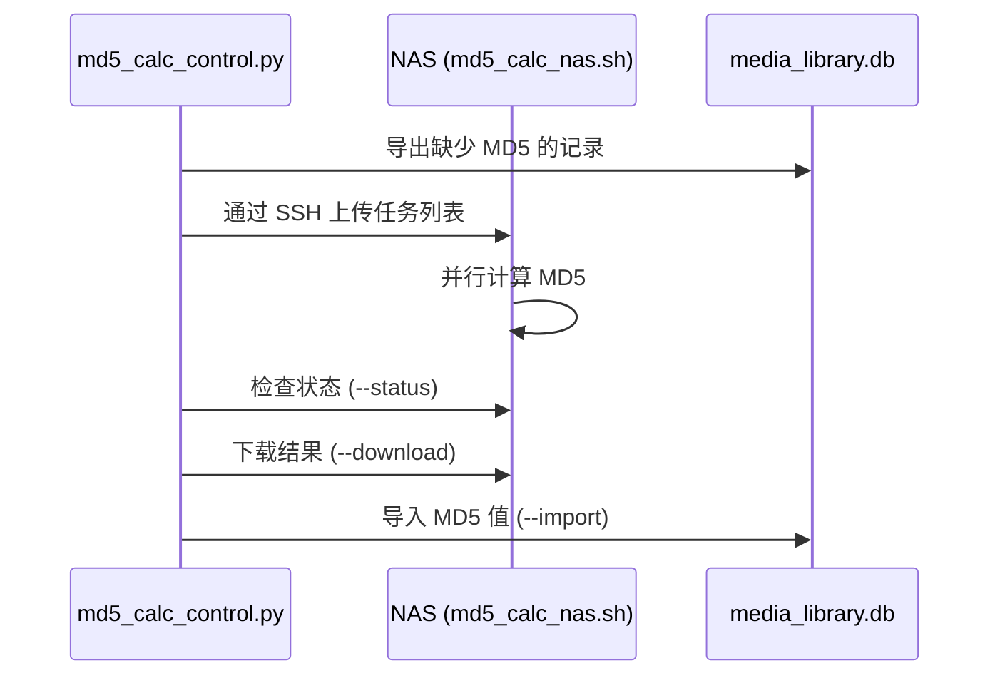

# MD5 工具

MD5 哈希在去重、移动检测和元数据匹配中起着核心作用。该系统支持本地计算以及针对大型媒体库的 NAS 端批量计算。

## 本地 MD5 计算

`utils/file_utils.py` 提供带有 JSON 缓存（`md5_cache.json`）的 MD5 计算功能：
- 通过分块读取文件内容来计算 MD5
- 以 `(file_path, file_size, mtime)` 为键缓存结果，从而跳过未修改的文件
- 缓存文件：`md5_cache.json`（典型媒体库约 700KB）

`calculate_missing_md5.py` 为尚无哈希值的现有数据库记录填补缺失的 MD5 值。

## NAS 端批量 MD5 计算

对于 NAS 挂载的媒体库（49000+ 个视频），通过网络在本地计算 MD5 极其缓慢。因此，系统支持 NAS 端批量计算：

### md5_calc_control.py
通过 4 个步骤编排完整的工作流：

```bash
# Step 1: Export tasks and upload to NAS
python3 md5_calc_control.py --export

# Step 2: Check computation status on NAS
python3 md5_calc_control.py --status

# Step 3: Download results
python3 md5_calc_control.py --download

# Step 4: Import results into database
python3 md5_calc_control.py --import
```

### md5_calc_nas.sh
在 NAS 上运行以并行计算 MD5 值的 Shell 脚本。处理由 md5_calc_control.py 导出的任务列表，并写入结果以供下载。

## 数据流



## 与智能导入器的集成

`resumable_smart_importer.py` 和 `smart_video_updater.py` 使用 MD5 哈希用于：
- 去重：跳过 MD5 匹配的文件
- 移动检测：如果路径改变但 MD5 匹配，则更新路径而不是重新插入
- NAS 前缀映射：smart_video_updater.py 在读取预先计算的 MD5 CSV 时，会在本地 (/Volumes/Video/) 和 NAS (/volume1/Video/) 路径之间进行映射

## 另请参阅

- [数据库概述](../database/overview.md) — md5_hash 列和索引
- [智能更新工具](smart_updating_tools.md) — 导入过程中如何使用 MD5
- [实用工具概述](overview.md) — FileUtils 和缓存