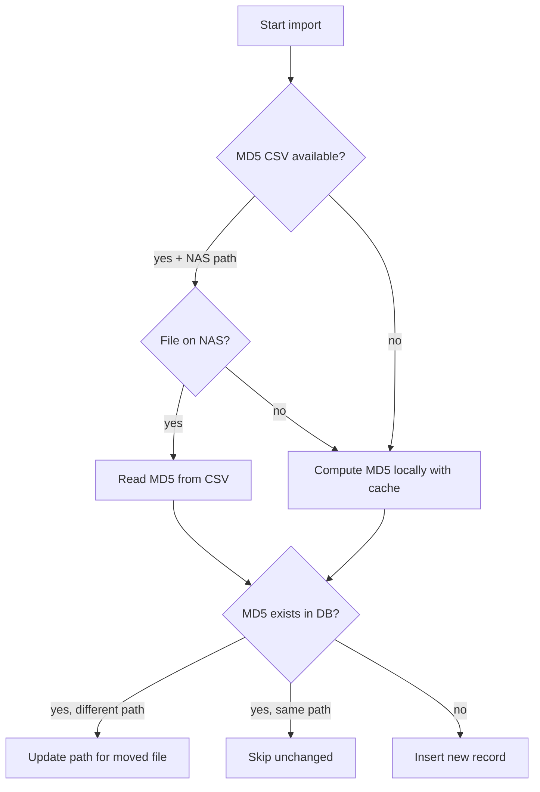

# 智能更新工具

用于增量视频导入和元数据同步的脚本。它们能够检测新增、移动和删除的文件，并相应地更新数据库，而无需进行全量重新扫描。

## 可恢复智能导入器

### `resumable_smart_importer.py`
功能最强大的导入器。特性包括：
- **基于检查点的可恢复性**：将进度保存到 `import_cache.json`；中断后可恢复
- **MD5 缓存**：避免对未更改的文件重新计算哈希值
- **智能移动检测**：如果数据库中已存在该 MD5 但路径不同，则更新路径而不是插入重复记录
- **视频扩展名过滤**：支持 `.mp4`、`.avi`、`.mkv`、`.mov`、`.wmv`、`.flv`、`.webm`、`.m4v`、`.3gp`、`.ts`、`.mts`、`.m2ts`
- **数据库 Schema 设置**：`ensure_tables_exist()` 会在缺失时创建所需的表

类：`ResumableSmartImporter(db_path, cache_file)`

## 智能视频更新器

### `smart_video_updater.py`
支持 NAS 的更新器，利用预计算的 MD5 CSV 文件：
- 通过 `MD5CSVIndex` 读取 `video_md5.csv`（路径 -> MD5 映射）
- 执行自动路径前缀映射：本地 `/Volumes/Video/` <-> NAS `/volume1/Video/`
- 对于 NAS 文件，使用 CSV 中的 MD5 而不是在本地计算（大幅提升速度）
- 对于非 NAS 文件，回退到本地 MD5 计算（带缓存）
- 复用 `ResumableSmartImporter` 的逻辑进行导入/移动检测

**用法：**
```bash
# Update all active folders using pre-computed MD5
python smart_video_updater.py --db media_library.db --md5-csv video_md5.csv --use-active-folders

# Update a specific folder
python smart_video_updater.py --db media_library.db --md5-csv video_md5.csv --folder "/Volumes/Video/Movies"
```

## 快速智能媒体更新器

### `fast_smart_media_updater.py`
轻量级的文件夹定向扫描器：
- 仅处理用户指定的在线文件夹
- 每个文件有四种处理结果：新增（插入）、未更改（跳过）、移动（更新路径）、删除（移除记录）
- 通过 `source_folder` 查询以最小化内存占用
- 支持基于 MD5 的移动检测

由 Docker 后端（`docker/backend/fast_smart_media_updater.py`）使用，用于容器化扫描。

## 统一视频更新器

### `unified_video_updater.py`
通过 MD5 或文件名匹配进行元数据同步：
- 批量更新标签、描述和其他元数据
- 跨不同路径或副本匹配视频
- 在抓取或手动修正元数据后使用

## 导入流水线


*smart_video_updater.py 中的导入决策流程。*

## 另请参阅

- [MD5 工具](md5_tools.md) — MD5 计算与 NAS 批量工作流
- [数据库概览](../database/overview.md) — Schema 与索引
- [同步脚本](../database/synchronization_scripts.md) — 更高层级的同步工具