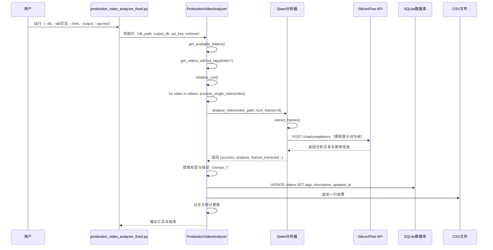

# Release 使用说明

本目录包含运行 `production_video_analyzer_fixed.py` 所需的全部代码与资源，支持在本地进行视频标签分析并将结果写入数据库与 CSV。

## 目录结构

- `production_video_analyzer_fixed.py`：生产分析主脚本，负责从数据库读取未标记视频，调用分析器执行分析，写入数据库与生成 CSV 报告。
- `video_analyzer_local_model_adult.py`：基于 SiliconFlow Qwen3-VL-8B-Instruct 的视频帧分析器，包含标签判定逻辑与提示词生成。
- `video_analyzer_pipeline.py`：流水线分析器，帧提取串行+API调用并行，最大化资源利用率。
- `adapter.py`：GUI桥接层，为 media_library.py 提供统一的视频分析接口。
- `video_integrity.py`：视频完整性检查工具，提供基础可播放与 seeking 跳转检测，避免损坏文件导致卡死。
- `vocabulary_tags.txt`：标签词汇表（122个标签），分析器会从此文件加载可判定的标签集合。
- `requirements_video_analyzer.txt`：运行所需的 Python 包。

## 环境要求

- Python 3（建议 3.9+）
- 可以访问 SiliconFlow API 的网络环境
- 已安装 `requirements_video_analyzer.txt` 中列出的依赖

## 安装依赖

```bash
pip install -r requirements_video_analyzer.txt -i https://pypi.tuna.tsinghua.edu.cn/simple
```

如不使用清华源，可去掉 `-i` 参数。

## 配置说明

- API 相关：
  - API地址：`https://api.siliconflow.cn`
  - 模型：`Qwen/Qwen3-VL-30B-A3B-Instruct`
- 视频处理：
  - 动态帧提取：超过10分钟按每分钟1帧，最多30帧
  - 10分钟以内固定8帧，帧均匀覆盖视频全程
  - 图片压缩：宽度640px，最大0.4MB
  - 标签数量：最多7个（特殊特征优先）
- 分析规则：
  - **只关注女性主角特征，完全忽略男性人物**
  - 流水线模式：边完成边写入数据库（中断不丢失）

## 标签优先级

```
特殊特征（最高） → 哺乳、乳汁、孕妇、萝莉、人妖
服装特征         → 黑丝、制服、情趣装、丝袜、眼镜
情节特征         → 偷情、出轨、调教、绿帽
人物特征         → 少妇、人妻、熟女、巨乳
行为特征（最低） → 自慰、口交、后入、内射
```

## API 密钥

- 优先从环境变量 `SILICONFLOW_API_KEY` 读取。
- 也可在运行时通过 `--api-key` 参数传入。

示例设置环境变量：

```bash
export SILICONFLOW_API_KEY="你的SiliconFlow密钥"
```

## 快速开始

1. 安装依赖
   ```bash
   pip install -r requirements_video_analyzer.txt -i https://pypi.tuna.tsinghua.edu.cn/simple
   ```
2. 运行主脚本（需提供数据库路径）
   ```bash
   python3 production_video_analyzer_fixed.py --db "/Users/firewell/Library/CloudStorage/OneDrive-个人/bioinfo/media/media_library.db" --verbose
   ```
3. 批量处理所有在线文件夹（跳过交互）
   ```bash
   python3 production_video_analyzer_fixed.py --db "/path/to/media_library.db" --all --verbose
   ```
4. 使用流水线模式（推荐，速度提升3-5倍）
   ```bash
   python3 production_video_analyzer_fixed.py --db "/path/to/media_library.db" --pipeline --workers 5 --verbose
   ```
5. 限制处理数量用于测试
   ```bash
   python3 production_video_analyzer_fixed.py --db "/path/to/media_library.db" --limit 5 --verbose
   ```
6. 指定输出目录
   ```bash
   python3 production_video_analyzer_fixed.py --db "/path/to/media_library.db" --output "./outputs" --verbose
   ```
7. 直接传入 API Key
   ```bash
   python3 production_video_analyzer_fixed.py --db "/path/to/media_library.db" --api-key "your_api_key" --verbose
   ```

## 参数说明（主脚本）

- `--db`：SQLite 数据库文件路径，需包含 `videos` 与 `folders` 表且路径存在。
- `--output`：输出目录（日志与 CSV），默认当前脚本目录。
- `--verbose`：显示详细信息。
- `--limit`：限制处理的视频数量（测试用）。
- `--api-key`：显式传入 SiliconFlow API 密钥。
- `--all`：跳过交互模式，直接处理所有在线管理文件夹。
- `--pipeline`：使用流水线模式（帧提取串行+API并行），推荐开启，速度提升3-5倍。
- `--workers`：流水线模式下API并行数（默认3，建议5-10）。

## 标签词汇表

- 编辑 `vocabulary_tags.txt` 可调整可判定标签集合（当前122个标签）。
- 分析器会在提示词中动态嵌入标签，并在返回结果末尾生成"匹配标签：标签1、标签2…"的行，主脚本会解析该行并写入数据库与 CSV。

## 输出与结果

- CSV 报告：`production_analysis_YYYYMMDD_HHMMSS.csv`
  - 字段：视频ID、标题、文件路径、标签数量、标签列表、描述、分析时间、错误信息等
- 日志：`analysis_log.txt`
- 数据库：将标签与描述写回 `videos` 表（字段：`tags`、`description`），并记录更新时间。
- **流水线模式：边完成边写入数据库，中断后已完成的标签保留**

## 常见问题

- 运行报错"数据库文件不存在"：检查 `--db` 指定路径是否有效。
- "未找到需要分析的视频"：确保 `videos` 表中存在在线且无标签的视频记录；或切换到 `--all` 模式并确认 `folders` 表中的在线文件夹。
- API 调用失败：检查 `SILICONFLOW_API_KEY` 是否正确、网络是否可达，必要时稍后重试。
- 视频读取失败或卡死：`video_integrity.py` 的完整性与跳转检测可过滤有问题的视频文件。
- 中断后重新运行：已打标签的视频会自动跳过，无需担心重复处理。

## 调用关系图（主程序视角）

```mermaid
graph TD
    A[用户运行 production_video_analyzer_fixed.py] --> B[解析命令行参数]
    B --> C{是否 --all}
    C -- 是 --> D[调用 ProductionVideoAnalyzer.run(limit)]
    C -- 否 --> E[显示在线文件夹列表并选择]
    E --> D
    D --> F[get_videos_without_tags(folder?)]
    F --> G[initialize_csv()]
    G --> H[遍历视频列表]
    H --> I[process_single_video(video)]
    I --> J[VideoAnalyzerLocalModelAdult.analyze_video(video_path, num_frames=8)]
    J --> K[SiliconFlow API /chat/completions]
    K --> L[返回 analysis_text]
    L --> M[extract_tags_from_analysis]
    L --> N[extract_description_from_analysis]
    M --> O[save_tags_to_database(video_id, tags, description)]
    N --> O
    O --> P[save_to_csv(...)]
    P --> Q[log_message / 统计汇总]
```

## 时序图（主程序与外部服务）

